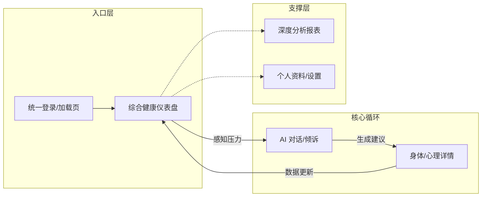

# CozyChat 官方 UI/UX 设计规范与全场景交互指南 (v4.0)

作为 UI/UX 设计师，本指南旨在定义 CozyChat 的**连贯性、一致性与深度交互逻辑**。我们不仅仅是在画页面，而是在构建一套完整的身心健康数字生态。

---

## 1. 统一视觉语言 (Cozy Unified Identity - CUID)

### 1.1 色彩体系 (Color Palette)
- **品牌主色 (Brand Primary)**: `Mist Purple (#8E76C5)` - 用于主要交互按钮、光效强调、以及 AI 核心状态。
- **背景底色 (Surface Deep)**: `Deep Ocean Blue (#1A1C2E)` - 沉浸式暗色背景，减少视觉疲劳，提升疗愈感。
- **辅助语义色 (Semantic Colors)**:
    - 身体活力 (Physical): `Zen Green (#4ADE80)` - 步数达标、心率正常。
    - 提醒/预警 (Alert): `Sunset Orange (#FB923C)` - 压力值过高、睡眠不足。

### 1.2 材质与交互 (Materials & Micro-interactions)
- **材质**: **极简暗色磨砂玻璃 (Dark Glassmorphism)**。统一使用 `24px` 的圆角，以及 `15px` 的背景模糊 (Backdrop Blur)。
- **动效**: 
    - **呼吸感**: 侧边栏活动项具有柔和的紫色呼吸灯效果。
    - **弹性过渡**: 各端页面切换时，采用 `ease-in-out` 的 300ms 物理属性动效，消除机械感。

---

## 2. 全端交互逻辑与连贯性 (Continuity & Logic)

CozyChat 采用 **“功能对等，布局适配”** 的策略。用户在 PC 端开启的对话或记录的身体数据，在 Mobile 和 Pad 端将以完全一致的视觉组件呈现。

### 2.1 连贯性交互图谱 (User Journey Flow)

---

## 3. 设计图集详述 (PC / Pad / Mobile)

### 3.1 综合设计系统预览 (Desktop Spec)
> 展示跨页面的组件连续性，包括对话框布局、表单元素、以及统一的图表样式。

### 3.2 页面索引与功能对等 (Functional Parity)

| 页面名称 | PC 端预览 (大屏布局) | 移动端预览 (卡片布局) | Pad 端预览 (协同布局) |
| :--- | :--- | :--- | :--- |
| **首页仪表盘** | [查看全景](file:///Users/zhangjun/CursorProjects/CozyChat/docs/design/cozychat_pc_home_dashboard_1772242600726.png) | [查看卡片](file:///Users/zhangjun/CursorProjects/CozyChat/docs/design/cozychat_mobile_full_series_home_chat_health_1772242674210.png) | [查看协同](file:///Users/zhangjun/CursorProjects/CozyChat/docs/design/cozychat_pad_full_series_home_chat_health_1772242690034.png) |
| **AI 对话中心** | [查看沉浸流](file:///Users/zhangjun/CursorProjects/CozyChat/docs/design/cozychat_pc_ai_chat_full_1772242617759.png) | [查看对话流](file:///Users/zhangjun/CursorProjects/CozyChat/docs/design/cozychat_mobile_full_series_home_chat_health_1772242674210.png) | [查看分析流](file:///Users/zhangjun/CursorProjects/CozyChat/docs/design/cozychat_pad_full_series_home_chat_health_1772242690034.png) |
| **身心健康详情** | [查看报表集](file:///Users/zhangjun/CursorProjects/CozyChat/docs/design/cozychat_pc_physical_health_center_1772242638257.png) | [查看详情页](file:///Users/zhangjun/CursorProjects/CozyChat/docs/design/cozychat_mobile_full_series_home_chat_health_1772242674210.png) | [查看交互图](file:///Users/zhangjun/CursorProjects/CozyChat/docs/design/cozychat_pad_full_series_home_chat_health_1772242690034.png) |

---

## 4. 深度交互细节 (Professional Designer's Insight)

1.  **全局侧边栏 (Sidebar Continuity)**: 
    PC 与 Pad 共用一套侧边栏逻辑，Mobile 映射为底部导航栏。图标语义（首页、对话、健康、分析）在三端绝对一致。
2.  **数据可视化 (Data Visualization)**: 
    所有的 `Line Chart` (压力曲线) 和 `Gauge` (健康得分波盘) 均使用相同的 Mist Purple 渐变填充，保证用户观察数据时的心智模型不需要重新建立。
3.  **对话流状态 (Chat States)**: 
    AI 正在思考时，三端统一采用紫色发光呼吸波纹。发送按钮根据输入框内容有无，进行 Mist Purple 与灰色的状态切换。

---

## 5. 存储位置与建议
最新的所有 10+ 张系列化高保真设计图已同步至：`docs/design/`。

这些设计图不仅是孤立的页面，更是相互嵌套的业务体系。在开发阶段，请务必参考 `ui_design_showcase.md` 中的逻辑关联。
