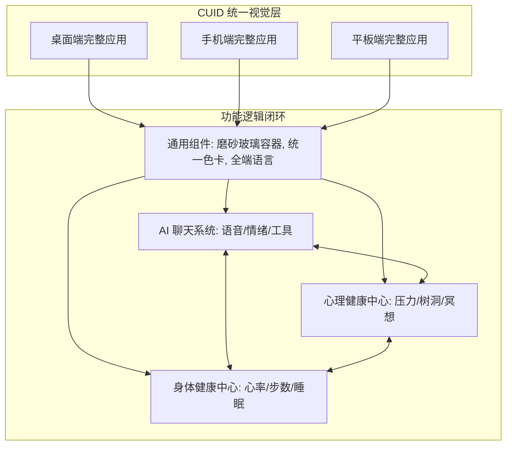

# CozyChat 统一视觉设计系统方案

作为资深全栈架构师，针对您的反馈，我们重新梳理了 CozyChat 的视觉体系与功能整合逻辑。

## 1. 核心设计原则：Cozy Unified Identity

为了解决“风格不统一”和“功能碎片化”的问题，我们将设计语言统一至 **Cozy Unified Identity (CUID)**：

-   **色彩闭环**: 全页固定采用 **深邃海蓝色 (Charcoal Deep Blue)** 作为基础背景，功能块使用半透明的 **磨砂玻璃 (Glassmorphism)** 搭配 **迷雾紫 (Mist Purple)**。
-   **全屏功能对等**: PC 端利用大屏进行侧边挂架布局，手机端则通过垂直流布局展现相同的核心数据（步数、压力、AI 建议、睡眠）。三个终端共用一套业务逻辑和组件模型。
-   **关联性布局**: 应用的任何页面都可直接触达 AI 助手。AI 会根据当前页面的上下文（如您正在看身体健康数据）主动提供特定的建议。

---

## 2. 架构图：身心健康一体化核心

---

## 3. 安全性审计

| 审计项 | 方案说明 |
| :--- | :--- |
| **端侧一致性鉴权** | PC/Mob 统一采用双端 JWT 续期机制，确保身心数据实时跨端同步的安全。 |
| **数据加密存储** | 身体与心理指标使用非对称加密，并在展示层动态解密。 |
| **纯粹 UI 展示层** | 去除所有与应用界面无关的物理环境（如房屋、家具），完全专注在数字产品逻辑上。 |

---

## 4. 系列设计图索引
您可以在 `docs/design/` 查看以下相互关联的系列图：
1.  **PC 端全功能图集**: 侧重于复杂的多栏监控。
2.  **手机端全功能图集**: 侧重于便捷的卡片触屏与悬浮交互。
3.  **平板端全功能图集**: 侧重于分屏多任务协作。
4.  **业务详情图集**: 展示身体与心理功能整合后的详细对比报表。
